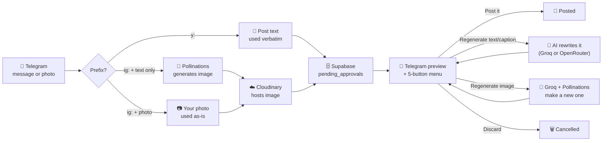

# 📮 social-publisher

**Text a bot. It posts what you typed — or ask it to write/generate something instead.**

An n8n automation that drafts and publishes content to personal LinkedIn and
personal Instagram (company LinkedIn next), gated behind a Telegram approval
step with a tap-to-choose menu. One bot, one workflow, one prefix per
platform.

```
y: <text>    →  posts that text to LinkedIn, verbatim
ig: <text>   →  posts that text to Instagram, verbatim, with an auto-generated image
```

Send a **photo** with `ig: <caption>` as its caption and it uses your own
photo instead of generating one. On every preview, a 5-button menu lets you
regenerate the text/caption, the image, both, post it, or discard — nothing
publishes until you tap **Post it**.

---

## How it works



LinkedIn posts start **text-only** — an image only enters the picture if you
tap "Regenerate image" (or "...+ image") from the menu, and once generated
it's shown back to you as a real photo before you can post it. Instagram
always needs media, so it auto-generates one immediately unless you sent
your own photo. The 5-button menu (regenerate text/caption+image, image
only, text/caption only, Post it, Discard) is identical on both platforms —
typed commands like `/approve` no longer do anything.

Everything above lives in **one n8n workflow** (`WF1 - LinkedIn Post
(Personal)` — the name is a holdover from before Instagram joined it). That's
deliberate, not an accident: Telegram allows only **one webhook per bot**, so
every platform's logic has to share the same workflow and Telegram trigger,
routed internally by message prefix. Two earlier attempts at giving a second
platform its own workflow both silently broke the first one's webhook — see
`.project-knowledge/history.md` for the full story.

---

## 🛠️ Setting this up from scratch

### 1. Prerequisites

| Need | For |
|---|---|
| n8n instance, reachable at a public URL (this project: Docker + ngrok) | Everything |
| Telegram bot ([@BotFather](https://t.me/BotFather)) + your numeric Telegram user ID | Everything |
| Supabase project with a `pending_approvals` table (schema below) | Everything |
| [Groq](https://console.groq.com) API key (free tier is fine) | LinkedIn text, both platforms' image prompts |
| [OpenRouter](https://openrouter.ai) API key | Instagram captions |
| [Cloudinary](https://cloudinary.com) account + an **unsigned** upload preset | Instagram, LinkedIn images |
| LinkedIn API access token + your LinkedIn person URN | LinkedIn |
| Meta Developer app + Facebook Page + linked Instagram Business account, with a long-lived Page Access Token | Instagram |

### 2. Supabase table

```sql
create table pending_approvals (
  id uuid primary key default gen_random_uuid(),
  telegram_user_id bigint not null,
  workflow_type text not null,        -- 'linkedin' | 'instagram' | ...
  resume_url text,
  content_preview text,
  status text not null check (status in ('pending', 'approved', 'rejected')),
  edit_instructions text,
  created_at timestamptz not null default now()
);
```

(Reconstructed from usage, not exported from Supabase directly — double-check
against your actual table before trusting it verbatim.)

### 3. Import the workflow

n8n → **Workflows → Import from File** → `workflows/main-workflow.json`.

### 4. Fill in every placeholder

The exported JSON has all real credentials and account-specific IDs stripped.
Search the workflow for each of these and replace with your own:

| Placeholder | Where | Get it from |
|---|---|---|
| Telegram credential | Every Telegram node | Create one in n8n (bot token from BotFather), attach it to each Telegram node |
| `REPLACE_WITH_GROQ_API_KEY` | `Rewrite with Instructions` (+ its `(Both)` clone), `Build Image Prompt` (+ its `(LI)` clone) | console.groq.com |
| `REPLACE_WITH_OPENROUTER_API_KEY` | `Generate Caption` | openrouter.ai |
| `REPLACE_WITH_SUPABASE_SERVICE_ROLE_KEY` | `Save to Supabase`, `Get Pending Approval` (+ `(Callback)`), `Update Status` (+ `(Callback)`), `Save to Supabase (IG)` — both `apikey` and `Authorization` headers on each | Supabase → Project Settings → API |
| `<your-project-ref>.supabase.co` | Same nodes' URLs | Your Supabase project URL |
| `REPLACE_WITH_LINKEDIN_ACCESS_TOKEN` | `Post to LinkedIn`, `Post to LinkedIn (Image)`, `Register LinkedIn Upload`, `Upload Image to LinkedIn` | LinkedIn API access token |
| `urn:li:person:<your-person-id>` | `Post to LinkedIn`, `Post to LinkedIn (Image)`, `Register LinkedIn Upload` bodies | Your own LinkedIn person URN |
| `REPLACE_WITH_META_PAGE_ACCESS_TOKEN` | `Create Media Container`, `Publish to Instagram` | Meta Graph API long-lived Page Access Token |
| `<your-ig-business-account-id>` | Both Instagram publish nodes' URLs | Your Instagram Business Account ID |
| `<your-upload-preset>` | `Upload to Cloudinary`, `Upload User Photo to Cloudinary` | Your Cloudinary unsigned upload preset name |
| `<your-cloud-name>` | Same two nodes' URLs | Your Cloudinary cloud name |

None of these are optional — the workflow won't run correctly until every one
points at **your own** accounts.

### 5. Activate it

Toggle the workflow **Active**, confirm Telegram's webhook is registered to it:

```bash
curl https://api.telegram.org/bot<TOKEN>/getWebhookInfo
```

Then text the bot `y: test` or `ig: test`.

---

## 💬 Day-to-day usage

| You send | What happens |
|---|---|
| `y: <text>` | Posts that text to LinkedIn verbatim, shows a preview with a 5-button menu |
| `ig: <caption>` | Posts that caption to Instagram verbatim with an auto-generated image, same menu |
| A photo with caption `ig: <caption>` | Uses your photo instead of generating one; caption stays verbatim |
| Tap **Post it** | Publishes the current draft (with whatever image/text state it's in) |
| Tap **Regenerate text/caption only** | Rewrites the text/caption (Groq for LinkedIn, OpenRouter for Instagram), keeps any existing image |
| Tap **Regenerate image only** | Generates a new AI image, keeps the current text/caption |
| Tap **Regenerate text/caption + image** | Redoes both from the original input |
| Tap **Discard** | Cancels the pending draft |

Typed commands (`/approve`, `/edit`, `/regenerate`, `/discard`, etc.) are no
longer wired to anything — the buttons are the only interface.

Only one draft is "pending" at a time per user — sending a new `y:`/`ig:`
message before resolving the previous one just queues a newer row; the
button menu always acts on the most recent one.

## 🎨 Customizing the writing voice

Each platform's tone lives entirely in its own system prompt — nothing is
shared:

- **LinkedIn** → `Rewrite with Instructions` (+ its `(Both)` clone, same
  prompt, via Groq) for the post text, `Build Image Prompt (LI)` (Groq) for
  the image description
- **Instagram** → `Build Image Prompt` (Groq, image description only) /
  `Generate Caption` (OpenRouter, caption text)

Edit the `content` field of the `role: 'system'` message in each node's Body
to change voice, length, hashtag rules, image style, or what topics it will
or won't cover.

## 🔄 Updating this repo after editing a workflow in the n8n UI

```bash
docker exec n8n n8n export:workflow --backup --output=/home/node/.n8n/workflow-backups/
docker cp n8n:/home/node/.n8n/workflow-backups/<workflow-id>.json ./workflows/main-workflow.json
docker exec n8n rm -rf /home/node/.n8n/workflow-backups/
```

**Before committing:** re-strip any real credentials and account IDs the
export re-introduces back to the placeholders above — the live n8n instance
is unaffected either way, only this repo's copy needs to stay clean.

(As of 2026-07-08, workflow edits are also sometimes made directly via n8n's
Public API rather than the UI — see `.project-knowledge/history.md`'s
Decisions section. Either way, always re-export/re-redact before committing.)

## ⚠️ Known open issues

See `.project-knowledge/roadmap.md` for the live list — notably, several
credentials are still hardcoded on nodes rather than proper n8n credentials,
and the old typed-command listener nodes are dead code pending cleanup.

---

Full evolving history, architecture notes, and every bug hit along the way
live in [`.project-knowledge/`](.project-knowledge/).
