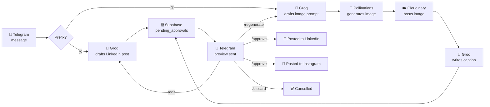

# 📮 social-publisher

**Text a bot. Get a draft. Approve it. It's live.**

An n8n automation that drafts and publishes content to personal LinkedIn and
personal Instagram (company LinkedIn next), gated behind a Telegram approval
step. One bot, one workflow, one prefix per platform.

```
y: <topic>   →  LinkedIn post
ig: <topic>  →  Instagram image + caption
```

---

## How it works



LinkedIn (top lane) never touches the image pipeline at all — only Instagram
(bottom lane) does. Both lanes converge only at Supabase/the preview step;
`/edit` and `/regenerate` loop back into their own platform's draft step, not
into each other.

Everything above lives in **one n8n workflow** (`WF1 - LinkedIn Post
(Personal)` — the name is a holdover from before Instagram joined it). That's
deliberate, not an accident: Telegram allows only **one webhook per bot**, so
every platform's logic has to share the same workflow and Telegram trigger,
routed internally by message prefix. Two earlier attempts at giving a second
platform its own workflow both silently broke the first one's webhook — see
`.project-knowledge/history.md` for the full story.

---

## 🛠️ Setting this up from scratch

### 1. Prerequisites

| Need | For |
|---|---|
| n8n instance, reachable at a public URL (this project: Docker + ngrok) | Everything |
| Telegram bot ([@BotFather](https://t.me/BotFather)) + your numeric Telegram user ID | Everything |
| Supabase project with a `pending_approvals` table (schema below) | Everything |
| [Groq](https://console.groq.com) API key (free tier is fine) | Everything |
| [Cloudinary](https://cloudinary.com) account + an **unsigned** upload preset | Instagram |
| LinkedIn API access token + your LinkedIn person URN | LinkedIn |
| Meta Developer app + Facebook Page + linked Instagram Business account, with a long-lived Page Access Token | Instagram |

### 2. Supabase table

```sql
create table pending_approvals (
  id uuid primary key default gen_random_uuid(),
  telegram_user_id bigint not null,
  workflow_type text not null,        -- 'linkedin' | 'instagram' | ...
  resume_url text,
  content_preview text,
  status text not null check (status in ('pending', 'approved', 'rejected')),
  edit_instructions text,
  created_at timestamptz not null default now()
);
```

(Reconstructed from usage, not exported from Supabase directly — double-check
against your actual table before trusting it verbatim.)

### 3. Import the workflow

n8n → **Workflows → Import from File** → `workflows/linkedin-post-personal.json`.

### 4. Fill in every placeholder

The exported JSON has all real credentials and account-specific IDs stripped.
Search the workflow for each of these and replace with your own:

| Placeholder | Where | Get it from |
|---|---|---|
| Telegram credential | Every Telegram node | Create one in n8n (bot token from BotFather), attach it to each Telegram node |
| `REPLACE_WITH_GROQ_API_KEY` | `Generate LinkedIn Post`, `Rewrite with Instructions`, `Build Image Prompt`, `Generate Caption` | console.groq.com |
| `REPLACE_WITH_SUPABASE_SERVICE_ROLE_KEY` | `Save to Supabase`, `Get Pending Approval`, `Update Status`, `Save to Supabase (IG)` — both `apikey` and `Authorization` headers on each | Supabase → Project Settings → API |
| `<your-project-ref>.supabase.co` | Same 4 nodes' URLs | Your Supabase project URL |
| `REPLACE_WITH_LINKEDIN_ACCESS_TOKEN` | `Post to LinkedIn` | LinkedIn API access token |
| `urn:li:person:<your-person-id>` | `Post to LinkedIn` body | Your own LinkedIn person URN |
| `REPLACE_WITH_META_PAGE_ACCESS_TOKEN` | `Create Media Container`, `Publish to Instagram` | Meta Graph API long-lived Page Access Token |
| `<your-ig-business-account-id>` | Both Instagram publish nodes' URLs | Your Instagram Business Account ID |
| `<your-upload-preset>` | `Upload to Cloudinary` | Your Cloudinary unsigned upload preset name |
| `<your-cloud-name>` | `Upload to Cloudinary` URL | Your Cloudinary cloud name |

None of these are optional — the workflow won't run correctly until every one
points at **your own** accounts.

### 5. Activate it

Toggle the workflow **Active**, confirm Telegram's webhook is registered to it:

```bash
curl https://api.telegram.org/bot<TOKEN>/getWebhookInfo
```

Then text the bot `y: test` or `ig: test`.

---

## 💬 Day-to-day usage

| You send | What happens |
|---|---|
| `y: <topic>` | Drafts a LinkedIn post about that topic |
| `ig: <topic>` | Drafts an Instagram image + caption about that topic |
| `/approve` | Publishes the most recent pending draft |
| `/edit <instructions>` | *(LinkedIn)* Rewrites the draft per your instructions, sends a new preview |
| `/regenerate` | *(Instagram)* Redoes the image + caption from the same topic, sends a new preview |
| `/discard` | Cancels the pending draft |

Only one draft is "pending" at a time per user — sending a new `y:`/`ig:`
message before approving/discarding the previous one just queues a newer row;
`/approve` always acts on the most recent one.

## 🎨 Customizing the writing voice

Each platform's tone lives entirely in its own Groq system prompt — nothing
is shared:

- **LinkedIn** → `Generate LinkedIn Post` / `Rewrite with Instructions`
- **Instagram** → `Build Image Prompt` (image description only) / `Generate Caption`

Edit the `content` field of the `role: 'system'` message in each node's Body
to change voice, length, hashtag rules, or what topics it will or won't cover.

## 🔄 Updating this repo after editing a workflow in the n8n UI

```bash
docker exec n8n n8n export:workflow --backup --output=/home/node/.n8n/workflow-backups/
docker cp n8n:/home/node/.n8n/workflow-backups/<workflow-id>.json ./workflows/linkedin-post-personal.json
docker exec n8n rm -rf /home/node/.n8n/workflow-backups/
```

**Before committing:** re-strip any real credentials and account IDs the
export re-introduces back to the placeholders above — the live n8n instance
is unaffected either way, only this repo's copy needs to stay clean.

## ⚠️ Known open issues

See `.project-knowledge/roadmap.md` for the live list — notably, Instagram's
generated images/captions/hashtags are still considered low-quality as of the
last update, and several credentials are still hardcoded on nodes rather than
proper n8n credentials.

---

Full evolving history, architecture notes, and every bug hit along the way
live in [`.project-knowledge/`](.project-knowledge/).
