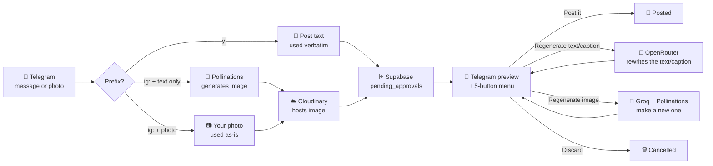

# 📮 social-publisher

**Text a bot. It posts what you typed — or ask it to write/generate something instead.**

An n8n automation that drafts and publishes content to personal LinkedIn and
personal Instagram (company LinkedIn next), gated behind a Telegram approval
step with a tap-to-choose menu. One bot, one workflow, one prefix per
platform.

```
y: <text>    →  posts that text to LinkedIn, verbatim
ig: <text>   →  posts that text to Instagram, verbatim, with an auto-generated image
```

Send a **photo** with `ig: <caption>` as its caption and it uses your own
photo instead of generating one. On every preview, a 5-button menu lets you
regenerate the text/caption, the image, both, post it, or discard — nothing
publishes until you tap **Post it**.

---

## How it works



LinkedIn posts start **text-only** — an image only enters the picture if you
tap "Regenerate image" (or "...+ image") from the menu, and once generated
it's shown back to you as a real photo before you can post it. Instagram
always needs media, so it auto-generates one immediately unless you sent
your own photo. The Instagram preview arrives as **two Telegram messages** —
the image first, then the full caption with the menu beneath it — so long
captions aren't cut off by Telegram's 1024-char photo-caption limit. The
5-button menu (regenerate text/caption+image, image only, text/caption only,
Post it, Discard) is identical on both platforms — typed commands like
`/approve` no longer do anything.

Everything above lives in **one n8n workflow** (`Telegram Publisher (LinkedIn
 + IG)` — it used to be named `WF1 - LinkedIn Post (Personal)`, a holdover from
 before Instagram joined it). That's deliberate, not an accident: Telegram
 allows only **one webhook per bot**, so
every platform's logic has to share the same workflow and Telegram trigger,
routed internally by message prefix. Two earlier attempts at giving a second
platform its own workflow both silently broke the first one's webhook — see
`.project-knowledge/history.md` for the full story.

---

## 🛠️ Setting this up from scratch

### 1. Prerequisites

| Need | For |
|---|---|
| n8n instance, reachable at a public URL (this project: Docker + ngrok) | Everything |
| Telegram bot ([@BotFather](https://t.me/BotFather)) + your numeric Telegram user ID | Everything |
| Supabase project with a `pending_approvals` table (schema below) | Everything |
| [Groq](https://console.groq.com) API key (free tier is fine) | Both platforms' FLUX image prompts |
| [OpenRouter](https://openrouter.ai) API key | LinkedIn post text + Instagram captions (all text/caption generation) |
| [Cloudinary](https://cloudinary.com) account + an **unsigned** upload preset | Instagram, LinkedIn images |
| LinkedIn API access token + your LinkedIn person URN | LinkedIn |
| Meta Developer app + Facebook Page + linked Instagram Business account, with a long-lived Page Access Token | Instagram |

### 2. Supabase table

```sql
create table pending_approvals (
  id uuid primary key default gen_random_uuid(),
  telegram_user_id bigint not null,
  workflow_type text not null,        -- 'linkedin' | 'instagram' | ...
  resume_url text,
  content_preview text,
  status text not null check (status in ('pending', 'approved', 'rejected')),
  edit_instructions text,
  created_at timestamptz not null default now()
);
```

(Reconstructed from usage, not exported from Supabase directly — double-check
against your actual table before trusting it verbatim.)

### 3. Import the workflow

n8n → **Workflows → Import from File** → `workflows/main-workflow.json`.

### 4. Create the credentials

The workflow JSON contains **no secrets** — every API key lives in an n8n
credential, referenced by name. Create each of these in n8n (**Credentials →
New credential → Import**) before activating:

| n8n credential name | n8n type | Fields |
|---|---|---|
| `Telegram account` | Telegram account | bot token from BotFather |
| `OpenRouter (Header Auth)` | Header Auth | `Authorization` = `Bearer <openrouter key>` |
| `Groq API` | Header Auth | `Authorization` = `Bearer <groq key>` |
| `Supabase` | Header Auth | `apikey` = `<service_role key>` (no `Authorization` needed) |
| `LinkedIn API` | Header Auth | `Authorization` = `Bearer <linkedin access token>` |
| `Meta Instagram` | Query Auth | `access_token` = `<long-lived Page Access Token>` |

The token is sent as a query parameter for Meta (`access_token=...`, which the
Graph API accepts on every endpoint) and as the `apikey` header for Supabase
— that single header is all Supabase requires.

Account-specific IDs are hardcoded in node URLs/expressions (they aren't
secrets): your Supabase project ref (`xiqohqytcyjiqskkextz`), LinkedIn person
URN (`urn:li:person:kvFSUycND7`), Instagram Business Account ID
(`17841476339271624`), and Cloudinary cloud `cbolcssr` + unsigned preset
`ttloffm8`. Replace these with your own after importing.

> On import, n8n can't match the placeholder credential IDs, so it shows each
> node's credential as unresolved — just click it and pick the matching
> credential from the dropdown (matched by name above).

### 5. Activate it

Toggle the workflow **Active**, confirm Telegram's webhook is registered to it:

```bash
curl https://api.telegram.org/bot<TOKEN>/getWebhookInfo
```

Then text the bot `y: test` or `ig: test`.

---

## 💬 Day-to-day usage

| You send | What happens |
|---|---|
| `y: <text>` | Posts that text to LinkedIn verbatim, shows a preview with a 5-button menu |
| `ig: <caption>` | Posts that caption to Instagram verbatim with an auto-generated image, same menu |
| A photo with caption `ig: <caption>` | Uses your photo instead of generating one; caption stays verbatim |
| Tap **Post it** | Publishes the current draft (with whatever image/text state it's in) |
| Tap **Regenerate text/caption only** | Rewrites the text/caption (OpenRouter `gpt-4o-mini`, both platforms), keeps any existing image |
| Tap **Regenerate image only** | Generates a new AI image, keeps the current text/caption |
| Tap **Regenerate text/caption + image** | Redoes both from the original input |
| Tap **Discard** | Cancels the pending draft |

Typed commands (`/approve`, `/edit`, `/regenerate`, `/discard`, etc.) are no
longer wired to anything — the buttons are the only interface.

Only one draft is "pending" at a time per user — sending a new `y:`/`ig:`
message before resolving the previous one just queues a newer row; the
button menu always acts on the most recent one.

## 🎨 Customizing the writing voice

Each platform's tone lives entirely in its own system prompt — nothing is
shared:

- **LinkedIn** → `Rewrite with Instructions` (+ its `(Both)` clone, same
  prompt, via OpenRouter `gpt-4o-mini`) for the post text,
  `Build Image Prompt (LI)` (Groq) for the image description
- **Instagram** → `Build Image Prompt` (Groq, image description only) /
  `Generate Caption` (OpenRouter `gpt-4o-mini`, caption text)

The prompts live in **`prompts/*.txt`**, not inside the workflow JSON. A
`Load Prompts` Code node at the start of the workflow reads them from disk on
every run, so **editing a `.txt` file takes effect immediately** — no n8n
editing or workflow changes needed:

| File | Used by | Purpose |
|------|---------|---------|
| `prompts/rewrite-linkedin.txt` | `Rewrite with Instructions`, `Rewrite with Instructions (Both)` | LinkedIn post text voice |
| `prompts/image-prompt-li.txt` | `Build Image Prompt (LI)` | LinkedIn image description |
| `prompts/caption-ig.txt` | `Generate Caption` | Instagram caption voice |
| `prompts/image-prompt-ig.txt` | `Build Image Prompt` | Instagram image description |

The host folder `~/n8n/prompts` (edit here) is bind-mounted into the n8n
container at `/home/node/prompts`; `prompts/` in this repo is the
version-controlled copy. The container needs `NODE_FUNCTION_ALLOW_BUILTIN=fs`
so the Code node can read the files — see `.project-knowledge/stack.md`.

## 🔄 Updating this repo after editing a workflow in the n8n UI

```bash
docker exec n8n n8n export:workflow --backup --output=/home/node/.n8n/workflow-backups/
docker cp n8n:/home/node/.n8n/workflow-backups/<workflow-id>.json ./workflows/main-workflow.json
docker exec n8n rm -rf /home/node/.n8n/workflow-backups/
```

**Before committing:** credentials are never in the export (n8n keeps them
encrypted separately), so no re-stripping is needed for keys. Just clear the
`pinData` field (editor test-execution snapshots) if the export re-introduces
it, and keep account-specific IDs as you want them documented. The live n8n
instance is unaffected either way; only this repo's copy needs to stay clean.

(As of 2026-07-08, workflow edits are also sometimes made directly via n8n's
Public API rather than the UI — see `.project-knowledge/history.md`'s
Decisions section. Either way, always re-export/re-redact before committing.)

## ⚠️ Known open issues

See `.project-knowledge/roadmap.md` for the live list — notably, several
credentials are still hardcoded on nodes rather than proper n8n credentials,
and the old typed-command listener nodes are dead code pending cleanup.

---

Full evolving history, architecture notes, and every bug hit along the way
live in [`.project-knowledge/`](.project-knowledge/).

---

<details>
<summary>🧠 AI Context</summary>

This project uses the [project-knowledge](https://github.com/YahyaZekry/claude-code-skills) skill to maintain a `.project-knowledge/` folder — a living, AI-readable map of the codebase. Every AI session loads only the files relevant to the current task instead of scanning from scratch.

Built by [Yahya Zekry](https://github.com/YahyaZekry/claude-code-skills).

</details>
